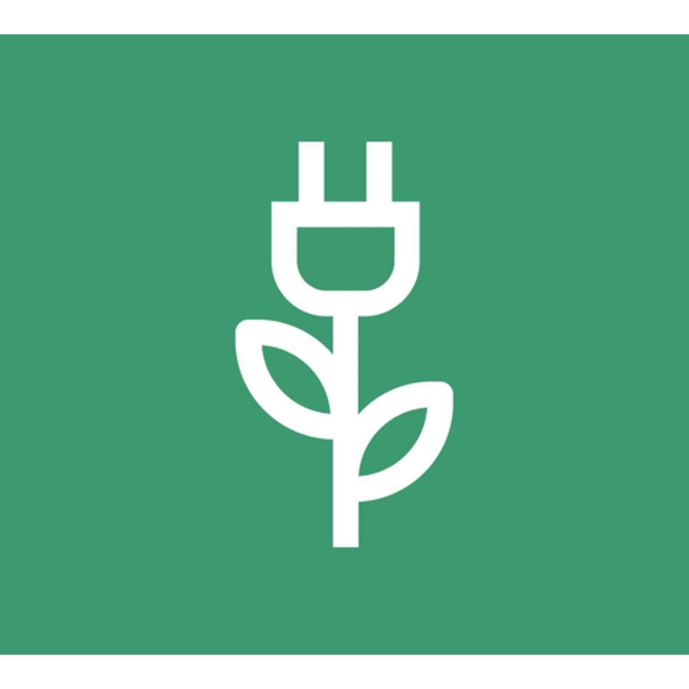

# Green-AI: Your Intelligent Plant Care Companion

<div align="center">
  
</div>

<p align="center">
  <strong>Green-AI is a full-stack, AI-powered smart agriculture platform that seamlessly integrates IoT hardware with a modern web application. It empowers users to automate plant care, monitor conditions in real-time, and diagnose plant diseases using the power of Google's Gemini AI.</strong>
</p>

---

## Table of Contents

- [The Vision](#the-vision)
- [Live Application](#live-application)
- [Core Features](#core-features)
- [How It Works: System Architecture](#how-it-works-system-architecture)
  - [The Web Application (Next.js & Vercel)](#the-web-application-nextjs--vercel)
  - [The Smart Device (ESP32-CAM)](#the-smart-device-esp32-cam)
  - [The AI Brain (Google Gemini)](#the-ai-brain-google-gemini)
- [Getting Started: Full Setup Guide](#getting-started-full-setup-guide)
  - [Step 1: Web Application Setup (Vercel)](#step-1-web-application-setup-vercel)
  - [Step 2: ESP32 Hardware & Circuit Setup](#step-2-esp32-hardware--circuit-setup)
  - [Step 3: Flashing the ESP32 Firmware](#step-3-flashing-the-esp32-firmware)
  - [Step 4: First-Time Device Connection](#step-4-first-time-device-connection)
- [Technology Stack](#technology-stack)
- [The Team](#the-team)

## The Vision

The goal of Green-AI is to make advanced agriculture technology accessible to everyone, from hobbyists to small-scale farmers. By combining the real-time sensing capabilities of IoT devices with the analytical power of generative AI, Green-AI creates a closed-loop system that not only automates the tedious aspects of plant care but also provides intelligent, actionable insights. This project is a demonstration of how modern AI and hardware can come together to build truly smart, responsive, and useful applications.

## Live Application

You can see a live version of the Green-AI web application deployed here:

**[https://final-green-ai.vercel.app/](https://final-green-ai.vercel.app/)**

## Core Features

### 1. AI-Powered Plant Care Guides
- **Dynamic Plant Search**: Users can search for any plant species.
- **AI-Generated Conditions**: The application uses Google's Gemini AI to generate the ideal environmental conditions (soil moisture, temperature, light levels, and air quality) for the selected plant.

### 2. Real-Time Monitoring Dashboard
- **Live Sensor Data**: The dashboard displays real-time data streamed from the ESP32, including temperature, humidity, soil moisture, ambient light, and air quality (MQ-2).
- **Actuator Status**: Visually confirm the current state (ON/OFF) of the water pump, fan, and grow light.
- **Connection Status**: Easily see if your ESP32 device is connected and sending data.

### 3. Automated & Manual System Control
- **Intelligent Automation**: The ESP32 device automatically controls the connected water pump, fan, and grow light based on the AI-generated thresholds.
- **Dashboard Toggles**: Users have the power to manually override the automation. From the dashboard, you can enable or disable "Auto Irrigation" and "Night Lighting" at any time.

### 4. AI-Powered Disease Diagnosis
- **Manual Upload**: Users can upload a photo of a plant to get an instant AI-powered diagnosis. The model identifies whether the plant is healthy, and if not, names the disease and suggests a remedy.
- **Automated Diagnosis**: The ESP32-CAM automatically captures and uploads a photo of the plant at regular intervals, providing a continuous health log on the dashboard.

### 5. Secure and Robust IoT Communication
- **API Key Authentication**: All communication between the ESP32 device and the backend is secured with a secret API key, ensuring that only your authorized device can send data.
- **User-Friendly WiFi Setup**: Using WiFiManager, the ESP32 creates its own Wi-Fi access point on first boot. The user can connect to it from a phone to easily configure home Wi-Fi credentials without ever needing to hardcode them.

### 6. Live Video Streaming
- **Real-Time Feed**: Monitor your plants from anywhere with a live MJPEG video stream from the ESP32-CAM, accessible directly from the dashboard.

## How It Works: System Architecture

Green-AI consists of three main components working in harmony.

### The Web Application (Next.js & Vercel)
This is the central hub and user interface.
- **Frontend**: Built with **Next.js** and **React**, using **ShadCN** for UI components and **Tailwind CSS** for styling. It provides a responsive and interactive user experience.
- **Backend**: Server-side logic is handled by Next.js API Routes. It exposes secure endpoints for the ESP32 to communicate with.
- **Database**: Uses **MongoDB** with **Prisma** as the ORM to store user data, device information, sensor readings, and diagnosis history.
- **Deployment**: Hosted on **Vercel** for seamless deployment, scalability, and environment variable management.

### The Smart Device (ESP32-CAM)
This is the hardware that lives with the plants.
- **Microcontroller**: An **ESP32-CAM** board with an integrated camera and microSD card slot.
- **Sensors**: DHT22 (temperature/humidity), soil moisture sensor, LDR (light), and MQ-2 (air quality).
- **Actuators**: Relays controlling a water pump, a fan, and a grow light.
- **Firmware**: Written in **C++/Arduino**, the firmware is responsible for reading sensors, controlling actuators, and communicating with the web application's backend API over HTTPS.

### The AI Brain (Google Gemini)
This is where the "smart" comes from.
- **Generative AI**: Uses the **Google Gemini Pro** model via its API for text-based tasks, such as generating plant care conditions and powering the Agri-Chat assistant.
- **Vision AI**: Uses the **Google Gemini Pro Vision** model to analyze the images of plants uploaded from the web app or the ESP32 to diagnose diseases.

---

## Getting Started: Full Setup Guide

Follow these steps to get your own Green-AI system up and running.

### Step 1: Web Application Setup (Vercel)

1.  **Clone the Repository & Deploy:**
    - Fork this repository to your GitHub account.
    - Go to [Vercel](https://vercel.com/new) and import your forked repository to create a new project.

2.  **Set Environment Variables:**
    - In your Vercel project dashboard, go to `Settings > Environment Variables`.
    - You need to add two secret keys:
      1.  `GEMINI_API_KEY`: Your API key from [Google AI Studio](https://aistudio.google.com/). This allows the web app to talk to the AI.
      2.  `ESP_API_KEY`: This is the secret key your ESP32 will use to authenticate with your backend. Set this to `Green-AI`.

3.  **Redeploy:**
    - After adding the environment variables, you must redeploy your application for the changes to take effect. Go to the "Deployments" tab and redeploy the latest commit.

### Step 2: ESP32 Hardware & Circuit Setup

Gather your components and wire them according to the circuit diagram. You will need:
- An ESP32-CAM with a USB-to-serial programmer (FTDI).
- DHT22, Soil Moisture, LDR, and MQ-2 sensors.
- Three 5V relay modules.
- A 5V fan, 5V water pump, and a grow light.
- A breadboard and jumper wires.

**(A detailed circuit diagram should be placed here for clarity)**

### Step 3: Flashing the ESP32 Firmware

1.  **Install Arduino IDE** and the **ESP32 board support** package.
2.  **Install Libraries**: In the Arduino IDE, go to `Sketch > Include Library > Manage Libraries` and install:
    - `WiFiManager` by tzapu
    - `ArduinoJson` by Benoit Blanchon
    - `DHT sensor library` by Adafruit
3.  **Load the Code**:
    - Open the firmware file (`Espcode/smart-greenhouse-esp32.ino`) provided in this repository.
    - Ensure the following lines are set correctly:
      ```cpp
      const char* backendUrl = "https://final-green-ai.vercel.app";
      const char* apiKey = "Green-AI"; // Should match your Vercel ESP_API_KEY
      ```
4.  **Upload to ESP32-CAM**:
    - Select the `AI-Thinker ESP32-CAM` board in the IDE.
    - Connect the device, press the `RST` button, and upload the code.

### Step 4: First-Time Device Connection

1.  Power on the circuit.
2.  On your phone, connect to the Wi-Fi network named **"Green-AI-Device"** (password: `password`).
3.  A captive portal will open. Select your home Wi-Fi network and enter its password.
4.  The device will connect and is now online and integrated with your dashboard!

## Technology Stack

- **Frontend**: Next.js, React, TypeScript, Tailwind CSS, ShadCN UI
- **Backend**: Next.js API Routes
- **AI**: Google Gemini API (Genkit)
- **Database**: MongoDB with Prisma
- **Deployment**: Vercel
- **IoT Device**: ESP32-CAM
- **Firmware**: C++ / Arduino

## The Team

Green-AI was designed and developed by:

- **Omar Elbedawy**
- **Sameh Hasan**
- **Ahmed Nasef**

Feel free to contribute, open issues, or reach out with questions!
